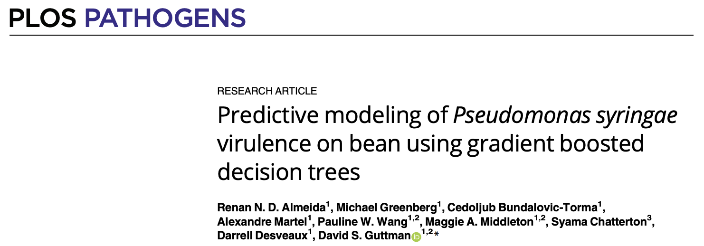

# Predictive modelling of Pseudomonas syringae virulence on bean using gradient boosted decision trees
This repository contains the machine learning model, scripts, and data for predicting Pseudomonas syringae virulence in beans using gradient boosted decision trees.

## Installation requirements

1. fsm-lite: https://github.com/nvalimak/fsm-lite
2. Python3 libraries:

`$ pip3 install pandas` 
`$ pip3 install numpy` 
`$ pip3 install rpy2` 
`$ pip3 install xgboost` 
`$ pip3 install sklearn` 

## Model training

This script uses Scikit-learn to train gradient boosted models to predict virulence/plant weight phenotypes based on whole-genome data from bacterial genomes.

`$ python3 stratified_rf_regressor_xgboost.py` 

## Model prediction

This script uses Skit-learn to for predict virulence/plant weight phenotypes based on whole-genome data from bacterial genomes.

`$ python3 predict_with_rg_regressor_xgboost.py` 

## Input files

* cluster_penotypes_kmers.rds: input table for model training in RDS format containing phenotype/plant weight values and presence and absence of kmers for the 318 isolates used in the study.
* model7.model: final gradient boosted model for predicting virulence/plant weight phenotypes.
